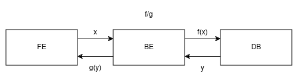

# Fundamentals of user programs and Obsidian on your phone + lappy

## Fundamentals of a service 
### or a website, or an app, or a program, or whatever is created by one person for someone else across the world to use

* Every application can be split into 3 parts.
  * frontend : what the user interacts with.
  * backend : bridge that connects the frontend to the database.
  * database : what holds the data
  

## Obsidian on your phone

If we are to apply these principles to using obsidian sync, we do the following steps.
1. Map the individual entities
   * The FE is the obsidian application.
   * The DB can be any data storage solution. Can be your personal server, your own laptop, or more. For now, we use github.
   * The BE is basically anything that allows us to transform the data and saves it to the db. Given that I chose github as my db, I can use the git client as my BE. It's already written, and already documented. Extensively.
   * So, my system -> Obsidian (FE) + Git CLI (BE) + Github (DB)
   * Note : Your's may vary depending on what you choose. I chose for simplicity.

2. Create the connector logic.
   1. BE <-> DB
	  * Start by modeling your data. Since it's github and "data modeling" basically means creating a repo, make one.
	  * "git pull" and "git push" get and set the data as required, and since we don't require any data transformation, the connectors between the DB and BE are already created.
   2. BE <-> FE
	  * The obsidian application works on your filesystem, so we can assume that the atomic unit of data in this system is a file.
		  * Different systems have different assumptions about their data. Data can just as easily be numbers, images, videos, etc. Model accordingly.
	  * If you're on a laptop, once you change the files using obsidian, you can simply commit the changes to the repository and push them to github for storage. This is the "connector", the ability for the files to be sent to the DB (github) using the BE (git cli).
	  * Should you be on a phone, you need to have the ability to commit and push changes. Herein lies the rub.
		  * The only commands you need to mostly run are 
			  1. `git add .`
			  2. `git commit -m "commit message`
			  3. `git push`

### The problem
1. How do I run terminal commands on my phone ? Termux
2. How do I automate the commands so that I do not need to type them every single time ? Tasker (paid. Not sure of any open source solutions)
3. When should tasker commit and push the files ? Whenever they change

* Note : There is not need to automatically push any changes, but I wanted it, so I did it.

### The solution
1. Install termux. Use it to install git.
2. Generate and add your github ssh key on your phone to your account. [Link](https://docs.github.com/en/authentication/connecting-to-github-with-ssh/generating-a-new-ssh-key-and-adding-it-to-the-ssh-agent). Your BE and DB are now connected.
3. Install Tasker and Obsidian. Using termux, clone the repo into **user_space**. This is important, since obsidian can only access files on user space.
   * An aside here. Android devices are split into root and user spaces for reasons. Everything in non-rooted devices is accessible only in user space, not root. Hence, clone into user_space.
4. Install the termux plugin for tasker. You'll find this on f-droid. (I installed termux from there too).
4. Using tasker, create a profile for file modification. This can also be used to check for folder changes (i.e our repo).
5. Create a bash script that contains the git commands you want to run. For now, the commit message is autogenerated (we can use tasker to send the names of the files changed to the bash script, but MVP first, iterate later).
6. In the previously created profile, add a task that runs this bash file in termux whenever is modified.
7. Check the repo to find out if it's working. If it isn't, recheck your assumptions / connections and redo.
8. If it is......tada !
