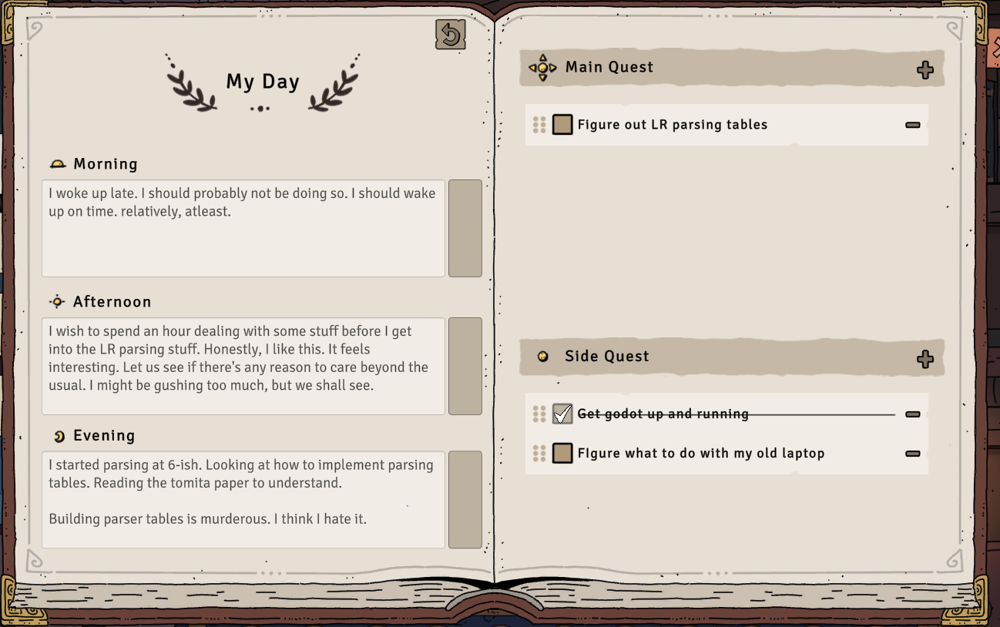

# 📖 My Day
- ## 🌅 Morning  
  I woke up late. I should probably not be doing so. I should wake up on time. relatively, atleast.
-
- ## ✨ Afternoon  
  I wish to spend an hour dealing with some stuff before I get into the LR parsing stuff. Honestly, I like this. It feels interesting. Let us see if there's any reason to care beyond the usual. I might be gushing too much, but we shall see.
- ## 🌙 Evening  
  I started parsing at 6-ish. Looking at how to implement parsing tables. Reading the tomita paper to understand.
  
  Building parser tables is murderous. I think I hate it.
  
  ---
- ## 🎯 Main Quest
- [ ] Figure out LR parsing tables
- ## 🗂️ Side Quest
- [x] ~~Get godot up and running~~
- [ ] Figure what to do with my old laptop
-
- {:height 467, :width 732}