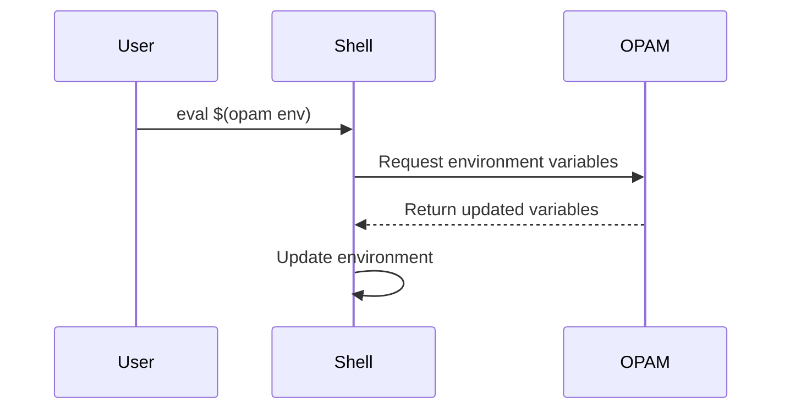
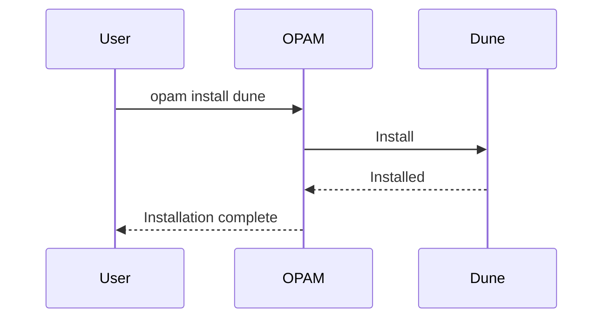
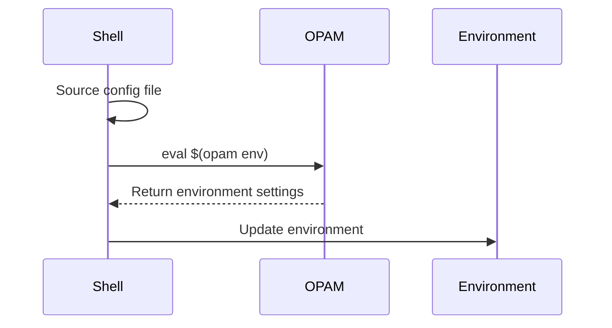

# Understanding OPAM and Dune in OCaml

## OPAM OCamlPackageManagerOCamlPackageManager

OPAM is the package manager for OCaml. It handles the installation and management of OCaml compilers, libraries, and tools.

### Key Features

    **Package Management**
    **Compiler Management**
    **Environment Management**

```mermaid
graph TD
AOPAMOPAM -- > BPackageManagementPackageManagement
A -- > CCompilerManagementCompilerManagement
A -- > DEnvironmentManagementEnvironmentManagement
```

OPAM uses *switches* to isolate project environments. Each switch can have its own compiler version and set of packages.

```mermaid
graph LR
AGlobalEnvironmentGlobalEnvironment -- > BSwitch1Switch1
A -- > CSwitch2Switch2
A -- > DSwitch3Switch3
```

## `opam env` Command

The `opam env` command updates your shell environment:

```bash
eval $(opam env)
```



## Dune Build System

Dune is the standard build system for OCaml projects.

### Key Features

    **Compilation**
    **Testing**
    **Installation**
    **Documentation generation**

```mermaid
graph TD
ADuneDune -- > BCompileCompile
A -- > CTestTest
A -- > DInstallInstall
A -- > EDocumentationDocumentation
```

Dune uses `dune-project` and `dune` files to define project structure.

```mermaid
graph TD
Adune\-projectdune\-project -- > BProjectMetadataProjectMetadata
Cdunefilesdunefiles -- > DBuildInstructionsBuildInstructions
EDuneDune -- > A
E -- > C
```

## Integration of OPAM and Dune

OPAM can install Dune, and Dune can generate OPAM files for package distribution.



```mermaid
graph LR
ADuneProjectDuneProject -- > Bdune\-projectdune\-project
B -- > CGenerateOPAMfileGenerateOPAMfile
C -- > DOPAMpackageOPAMpackage
```

## OPAM Configuration and Management

### Viewing OPAM Configuration

```mermaid
graph TD
AOPAMConfigOPAMConfig -- > Bopamconfiglistopamconfiglist
A -- > Copamswitchlistopamswitchlist
A -- > Dopamlistopamlist
A -- > Eopamvaropamvar
```

* `opam config list`: Shows current configuration
* `opam switch list`: Displays available and active switches
* `opam list`: Lists installed packages
* `opam var`: Shows OPAM variables

### Deciding When to Switch

```mermaid
flowchart TD
ANewProject?NewProject? ->|Yes| BDifferentOCamlversion?DifferentOCamlversion?
B ->|Yes| CCreatenewswitchCreatenewswitch
B ->|No| DUseexistingswitchUseexistingswitch
A ->|No| EConflictingdependencies?Conflictingdependencies?
E ->|Yes| C
E ->|No| D
```

Consider switching when:

* Starting a new project with a different OCaml version.
* Working on projects with conflicting dependencies.

## Automating `opam env`

You can automate the `opam env` command by adding it to your shell configuration:

For bash:

```bash
echo 'eval $(opam env)' >> ~/.bashrc
```

For zsh:

```bash
echo 'eval $(opam env)' >> ~/.zshrc
```



This automation ensures your OPAM environment is always up-to-date when you open a new shell. However, be aware that this might slightly increase your shell startup time.

Remember that if you switch OPAM environments within a session, you'll still need to run `eval $(opam env)` manually or restart your shell for the changes to take effect.

## Best Practices

    Use a separate switch for each project to avoid dependency conflicts.
    Always run `eval $(opam env)` after switching environments.
    Use `opam pin` to lock package versions for reproducible builds.
    Regularly update your OPAM repository with `opam update`.
    Use Dune for building and testing your OCaml projects.

## Troubleshooting

- If you encounter issues with package installation, try `opam update` followed by `opam upgrade`.
- For compiler-related problems, ensure you're using the correct switch with `opam switch list`.
- If Dune fails to build, check your `dune-project` and `dune` files for syntax errors.

---

Understanding OPAM and Dune will significantly enhance your OCaml programming experience, making development smoother and more efficient.